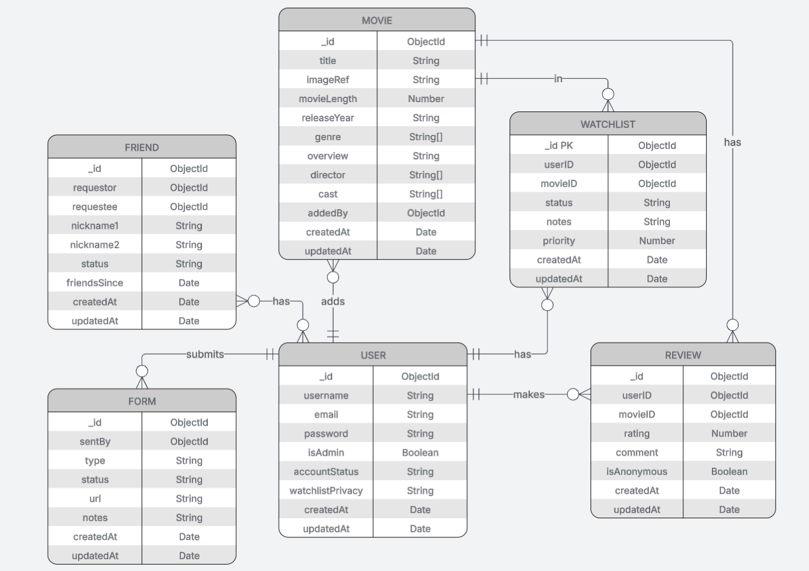

# MOVIE WATCHLIST & REVIEW HUB
Full-stack web application which allows users can add movies to a personal watchlist, mark them as watched, and leave reviews/ratings. 

## Features
- **User Account**: Register as new user, log in/out, update and delete profile
- **Watchlist Privacy**: Set watchlist visibility to public, private, or to friends only
- **Browse Movies**: Search and filter movies on the home page
- **Add Friends**: Add other users as friends
- **View Movie**: View movie details and reviews
- **Leave Reviews**: Add review and ratings to a movie
- **Watchlist**: Add movies to personal watchlist (watched, planning to watch)
- **Add new movies**: Admin user can add new movies

## Tech Stack
- **Backend**: Express.js with MVC architecture
- **Database**: MongoDB with Mongoose ODM
- **Frontend**: HTML with minimal CSS
- **Templates**: EJS
- **Environment**: Node.js

## Project Structure
```
is113-project/  
├── controllers/                  # MVC Controllers  
│   ├── feedbackController.js  
│   ├── friendController.js  
│   ├── indexController.js  
│   ├── listController.js  
│   ├── movieController.js  
│   ├── reviewController.js  
│   └── userController.js  
├── data/                          #Test Data
│   └── seed.js
│   └── testData.js 
├── middleware/                   # Utility Functions  
│   └── authentication.js  
├── models/                       # MongoDB Models  
│   ├── Feedback.js  
│   ├── Friend.js  
│   ├── Movie.js  
│   ├── review.js  
│   ├── User.js  
│   └── Watchlist.js  
├── public/                       # Static Assets  
│   ├── default.css  
│   └── uploads/  
│       ├── avatar.jpg  
│       ├── avengers.jpg  
│       ├── fight_club.webp  
│       ├── forrest_gump.jpg  
│       ├── gladiator.png  
│       ├── inception.jpg  
│       ├── interstellar.jpg  
│       ├── joker.jpg  
│       ├── parasite.jpg  
│       ├── pulp_fiction.jpg  
│       ├── the_avengers.jpg  
│       ├── the_dark_knight.jpg  
│       ├── the_matrix.jpg  
│       ├── the_social_network.jpg  
│       ├── titanic.jpg  
│       └── whiplash.jpg  
├── routes/                       # Express Routes  
│   ├── feedback.js  
│   ├── friends.js  
│   ├── index.js  
│   ├── movies.js  
│   ├── profile.js  
│   ├── reviews.js  
│   └── watchlist.js  
├── views/                        # EJS Templates  
│   ├── partial/  
│   │   ├── header.ejs  
│   │   ├── messages.ejs  
│   │   ├── watchlist-edit.ejs  
│   │   └── watchlist-row.ejs  
│   ├── admin-feedback.ejs  
│   ├── admin.ejs  
│   ├── browse-users.ejs  
│   ├── edit-profile.ejs  
│   ├── edit-movie.ejs  
│   ├── feedback.ejs  
│   ├── friends.ejs  
│   ├── index.ejs  
│   ├── login.ejs  
│   ├── manage-accounts.ejs  
│   ├── movie.ejs  
│   ├── profile.ejs  
│   ├── register.ejs  
│   ├── review.ejs  
│   └── watchlist.ejs  
├── .gitignore  
├── config.env                    # Environment Variables  
├── package-lock.json  
├── package.json  
├── server.js                     # Main Application File  
└── README.md  
```

Models: Define data structures in the models/ directory  
Controllers: Handle business logic in the controllers/ directory  
Routes: Define API endpoints in the routes/ directory  
Views: Create EJS templates in the views/ directory  
Public: Access public files in the public/ directory  
Here’s a cleaned-up version of your installation instructions with formatting fixes and minor clarifications:

---

## Installation

1. **Clone the repository**

```bash
git clone <repository-url>
cd is113-project
```

2. **Install dependencies**

```bash
npm install
```

3. **Set up environment variables**
   Create a `config.env` file in the root folder with the following content:

```
DB=<connection string to your database>
SECRET=<secure secret>
```

4. **Import sample data**

```bash
node data/seed.js
```

5. **Start the application**

```bash
nodemon server.js
```

6. **Launch in browser**

   Open [http://localhost:8000](http://localhost:8000)

7. **Log in with sample accounts**

* **User:** john_doe | john@example.com
* **User:** jane_smith | jane@example.com
* **Admin:** admin | admin@example.com

---

## Common errors
1. Error connecting to database
```
// disable this section after testing
const dns = require('node:dns');
dns.setServers(['8.8.8.8', '8.8.4.4']); // Use Google DNS
```
Check whether commenting in or out will allow connection to database in `server.js` & `data/seed.js`

2. Not injecting config.env
```
dotenv.config({ path: "./config.env" });
```
You may need to adjust the path to `config.env` inside `seed.js` (try .. instead of .)


## API Endpoints

### **Profile / User**

* `GET /` – Redirects to `/profile` if logged in or `/index` if not
* `GET /register` – Show registration form.
* `POST /register` – Submit new user registration
* `GET /login` – Show login form
* `POST /login` – Submit login credentials
* `GET /profile` – View user profile (requires login)
* `GET /edit-profile` – Get profile edit form (requires login)
* `POST /edit-profile` – Submit profile updates (requires login)
* `POST /delete-profile` – Delete user profile (requires login)
* `POST /logout` – Log out user
* `GET /manage-accounts` – Superadmin view all accounts (requires admin)
* `POST /manage-accounts/promote` – Promote a user to admin (requires admin)
* `POST /manage-accounts/demote` – Demote admin to user (requires admin)

---

### **Movies / Index**

* `GET /index` – List all movies
* `GET /index/view?movieId=<id>` – View details of a single movie

---

### **Watchlist**

* `GET /list` – View user watchlist (planned/watched, sorting, pagination)
* `GET /list/status` – Get status of a movie in user's watchlist
* `POST /list/edit` – Update a movie in watchlist (status, notes, priority)
* `POST /list/remove` – Remove a movie from watchlist
* `POST /list/add` – Add a movie to watchlist

---

### **Reviews**

* `GET /reviews` – Show all reviews
* `POST /reviews/add` – Add a review (requires login)
* `POST /reviews/edit` – Edit a review (requires login)
* `POST /reviews/del` – Delete a review (requires login)

---

### **Friends**

* `GET /friends` – View friends page (Friends, Sent Requests, Received Requests, Recommended)
* `GET /friends/browse` – Browse all users not friends/pending, with search and sort
* `POST /friends/send` – Send friend request
* `POST /friends/cancel` – Cancel sent friend request
* `POST /friends/accept` – Accept a friend request
* `POST /friends/decline` – Decline a friend request
* `POST /friends/remove` – Remove a friend
* `POST /friends/nickname` – Update nickname for a friend

---

### **Admin / Movies**

* `GET /admin` – Admin dashboard listing all movies
* `POST /admin/add` – Add a new movie 
* `GET /admin/edit?movieId=<id>` – Get edit form for movie
* `POST /admin/edit` – Update movie details (with optional image)
* `GET /admin/delete?movieId=<id>` – Delete movie

---

### **Feedback**

* `POST /feedback` – Create/submit feedback (requires login)
* `GET /feedback` – Read user feedback (requires login)
* `GET /feedback/admin` – Read all feedback for admin
* `POST /feedback/resolve/:id` – Admin marks feedback as resolved
* `POST /feedback/delete/:id` – Delete user feedback

---

### **Static / Misc**

* `GET /index.html` – Redirect to `/index`.
* `GET /` – Serve static files from `public` directory.

## Database Schema



<details>
<summary>userSchema</summary>

* **_id**: ObjectId  
* **username**: String  
* **email**: String  
* **password**: String (hashed)  
* **isAdmin**: Boolean  
* **accountStatus**: String (`active`, `suspended`, `disabled`)  
* **watchlistPrivacy**: String (`public`, `friends`, `private`)  
* **createdAt**: Date  
* **updatedAt**: Date  

</details>

<details>
<summary>friendSchema</summary>

* **_id**: ObjectId  
* **requestor**: ObjectId (references User)  
* **requestee**: ObjectId (references User)  
* **nickname1**: String  
* **nickname2**: String  
* **status**: String (`pending`, `accepted`)  
* **friendsSince**: Date  
* **createdAt**: Date  
* **updatedAt**: Date  

</details>

<details>
<summary>watchlistSchema</summary>

* **_id**: ObjectId  
* **userID**: ObjectId (references User)  
* **movieID**: ObjectId (references Movie)  
* **status**: String (`planning`, `watched`)  
* **notes**: String (max 256 characters)  
* **priority**: Number  
* **createdAt**: Date  
* **updatedAt**: Date  

</details>

<details>
<summary>movieSchema</summary>

* **_id**: ObjectId  
* **title**: String  
* **imageRef**: String (image file reference)  
* **movieLength**: Number (minutes)  
* **releaseYear**: String  
* **genre**: [String]  
* **overview**: String  
* **director**: [String]  
* **cast**: [String]  
* **addedBy**: ObjectId (references User)  
* **createdAt**: Date  
* **updatedAt**: Date  

</details>

<details>
<summary>reviewSchema</summary>

* **_id**: ObjectId  
* **userID**: ObjectId (references User)  
* **movieID**: ObjectId (references Movie)  
* **rating**: Number (1–5)  
* **comment**: String (max 8000 characters)  
* **isAnonymous**: Boolean  
* **createdAt**: Date  
* **updatedAt**: Date  

</details>

<details>
<summary>formSchema</summary>

* **_id**: ObjectId  
* **sentBy**: ObjectId (references User)  
* **type**: String (`feedback`, `bug`, `report`)  
* **status**: String (`pending`, `resolved`)  
* **url**: String  
* **notes**: String (max 256 characters)  
* **createdAt**: Date  
* **updatedAt**: Date  

</details>

## AI Declaration
- Generating boilerplate code for frontend ejs files
- Generating sample database data and script for automatic populating of data
- Create partial README.md file (formatting)